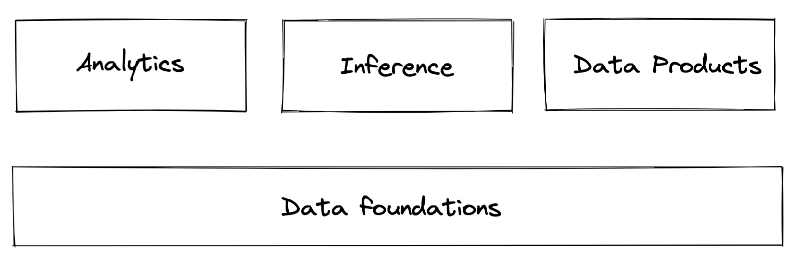
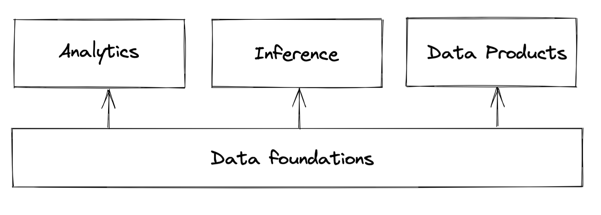
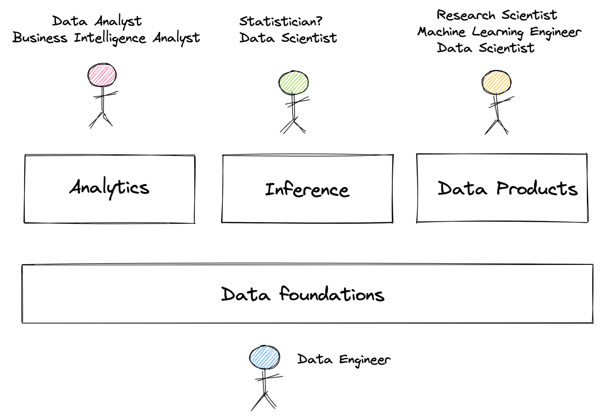
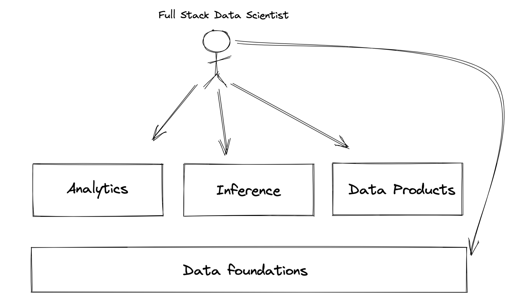
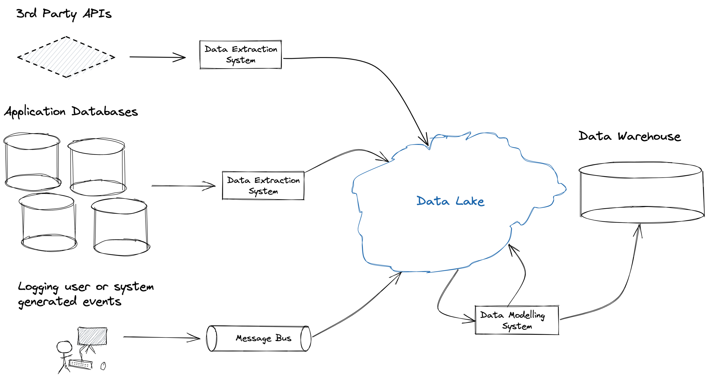
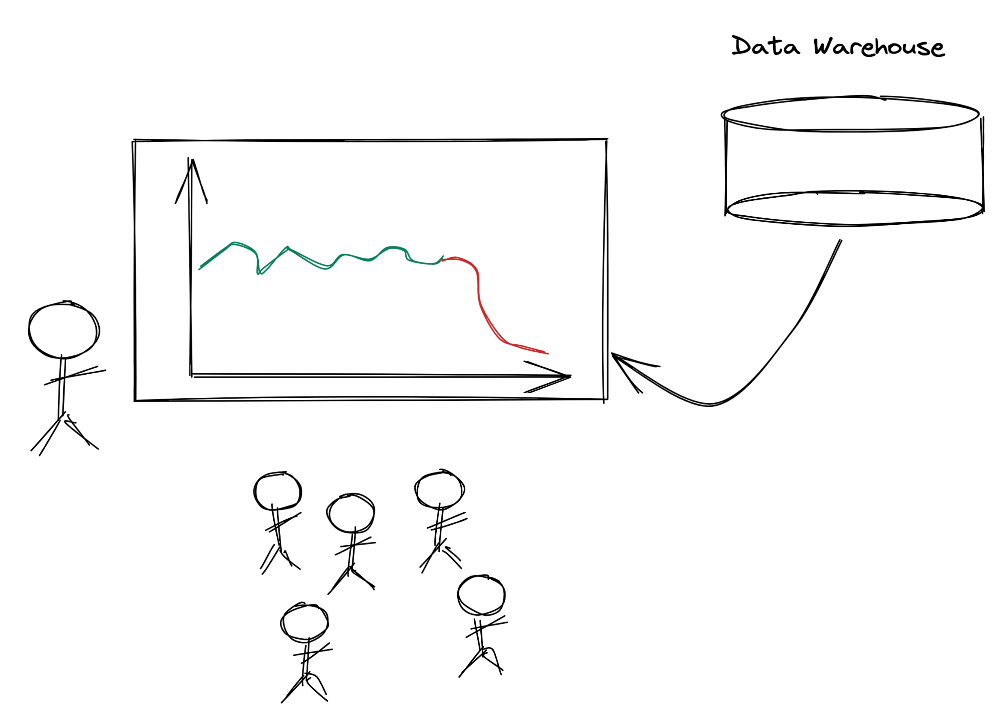
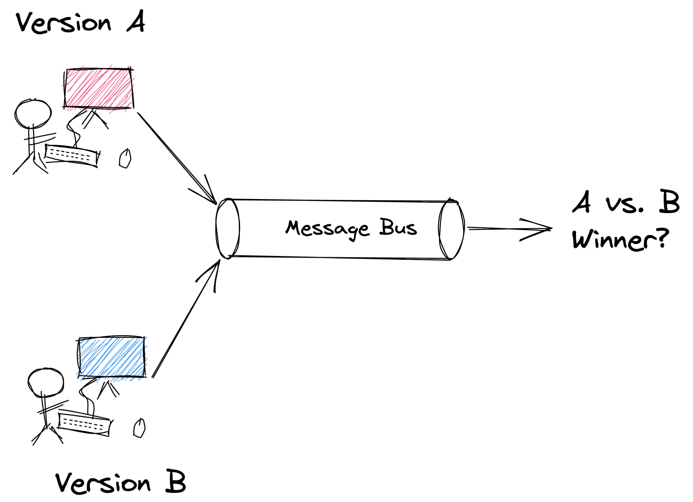
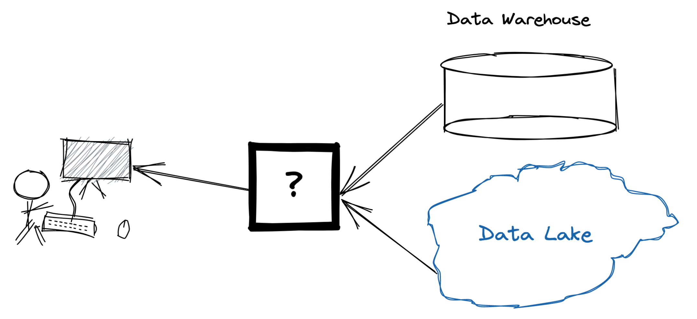
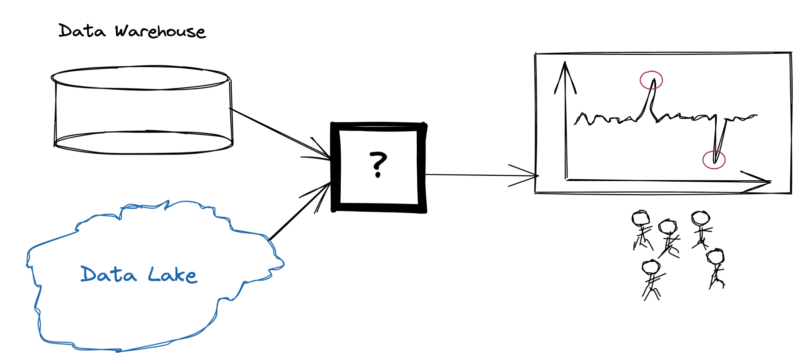

## Data Science @ Shopify

    
Vector Institute

    
2021-05-06

    
Ian Whitestone

note: example speakr notes!

Today's slides 👉 <a href='https://ianwhitestone.work/slides-v2/data-science-at-shopify.html'>ianwhitestone.work/talks</a>

#### Data Science?

*"Data science is an **interdisciplinary** field that uses scientific methods, processes, algorithms and systems to extract knowledge and insights from data, and apply knowledge and **actionable insights from data** across a **broad range** of application domains.”* - [Wikipedia](https://en.wikipedia.org/wiki/Data_science)

*“Data science is the field of study that combines domain expertise, programming skills, and knowledge of mathematics and statistics to extract meaningful insights from data”* - [Data Robot](https://www.datarobot.com/wiki/data-science/)

note: xxx

#### Data Science?

*“Data science combines the scientific method, math and statistics, **specialized programming, advanced analytics, AI, and even storytelling** to uncover and explain the **business insights** buried in data”* - [IBM](https://www.ibm.com/cloud/learn/data-science-introduction)

**“Machine learning, AI & big data”** - [Someone, probably]()

#### Data Science:

### **Data scientists create business value with data.**

### How to add value with data?

### How to add value with data?

### How to add value with data?

### Roles in data

### Data @ Shopify

### Data Foundations

### Analytics

* Conduct research to inform how products are built
* Set metrics, KPIs & targets
* Monitor product performance
* Perform deep dives to understand user behaviour
* Investigate anomalies

### Inference

* Does this new website design perform better than the original version? (A/B testing)
* What was the impact of product X on retention rates? (causal inference)

<section>
  <!-- <li class="smaller_text">But I'm not!</li> -->
  <h3>Data Products</h3>
  <h4>(external customer facing)</h4>

  <li class="smaller_text">How likely is this transaction to be fraudulent?</li>
  <li class="smaller_text">Should we offer $10,000 in funding to business X? What is the likelihood they will be able to pay it back?</li>
  <li class="smaller_text">What new countries should a business expand to, based on their historical data and what similar businesses have done?</li>
  <li class="smaller_text">Basic analytics & business performance monitoring for merchants (no machine learning required!)</li>

  
</section>

### Data Products
#### (internal customer facing)

* Forecasting & anomaly detection
* Customer upgrade scoring
* Customer churn prediction

# Questions?