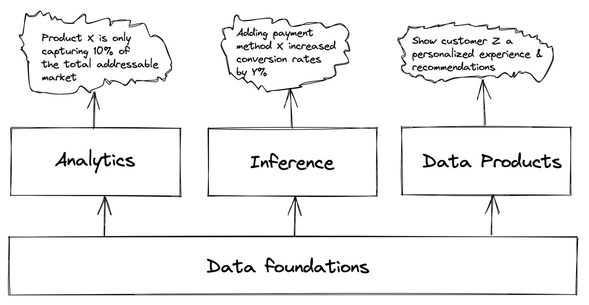

## Data Science @ Shopify

    
Vector Institute

    
2021-05-06

    
Ian Whitestone

note: example speakr notes!

Today's slides 👉 <a href='https://ianwhitestone.work/slides-v2/data-science-at-shopify.html'>ianwhitestone.work/talks</a>

---

## part 1: what the heck is data science?

#### Data Science?

*"Data science is an **interdisciplinary** field that uses scientific methods, processes, algorithms and systems to extract knowledge and insights from data, and apply knowledge and **actionable insights from data** across a **broad range** of application domains.”* - [Wikipedia](https://en.wikipedia.org/wiki/Data_science)

*“Data science is the field of study that combines domain expertise, programming skills, and knowledge of mathematics and statistics to extract meaningful insights from data”* - [Data Robot](https://www.datarobot.com/wiki/data-science/)

note: xxx

#### Data Science?

*“Data science combines the scientific method, math and statistics, **specialized programming, advanced analytics, AI, and even storytelling** to uncover and explain the **business insights** buried in data”* - [IBM](https://www.ibm.com/cloud/learn/data-science-introduction)

**“Machine learning, AI & big data”** - [Someone, probably]()

#### Data Science:

### **Data scientists create business value with data.**

### How to add value with data?

