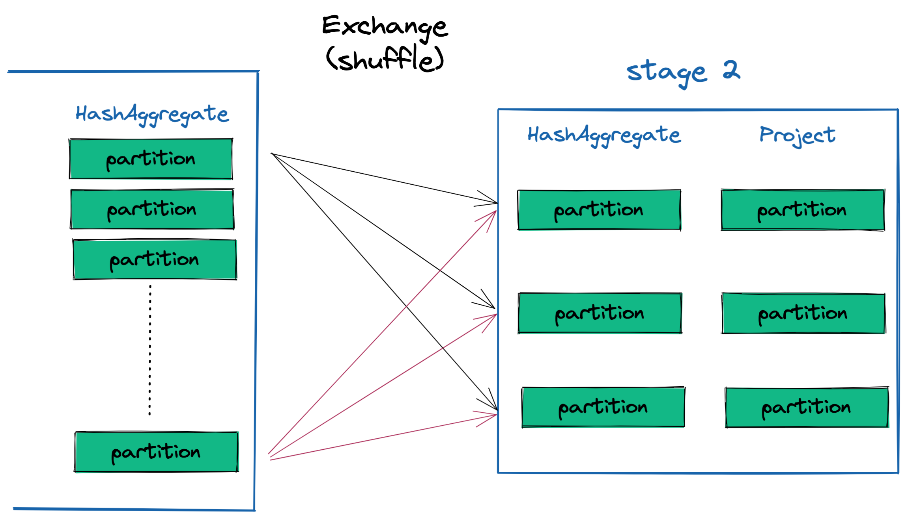
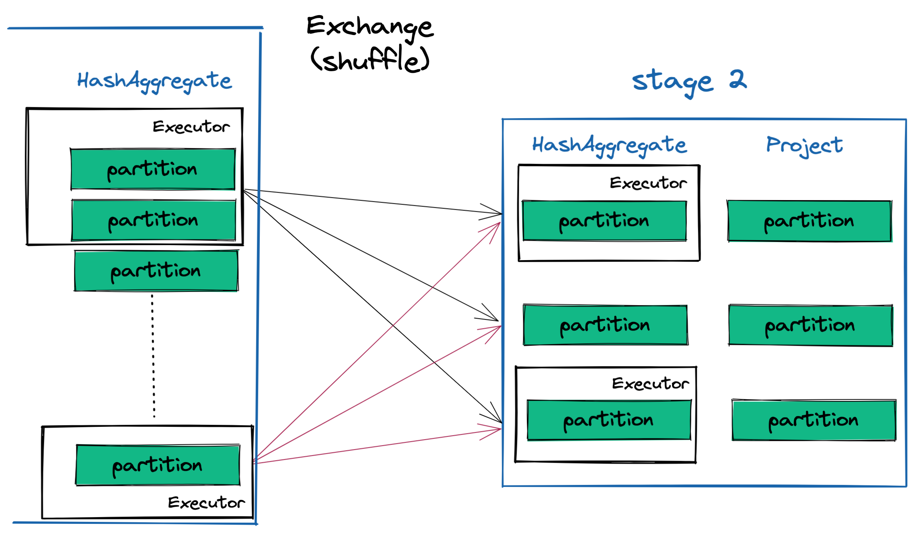

## In the trenches with Spark

<!-- 
 -->
 
 

  2021-11-02
   
  Slides 👉 <a href='https://ianwhitestone.work/slides-v2/in-the-trenches-with-spark.html'>ianwhitestone.work/talks</a>

<!-- 
 -->

note: example speakr notes!

### Motivation

<li>Most of the time, Spark jobs just work </li>
<li class="fragment"> But when they don't, most people struggle to understand why and reason about a proper solution</li> 
<li class="fragment"> To fix or optimize a job, you need to understand how Spark works under the hood so you can think from first principles </li> 

### Agenda

<ul style="display: list-item">
  <li>Intro to Spark
    <ul>
      <li>Architecture overview</li>
      <li>Common terminology</li>
    </ul>
  </li>
  <li>Example Jobs
    <ul>
      <li>Aggregating transactions</li>
      <li>Enriching user event logs</li>
    </ul>
  </li>
  <li>Spark Web UI Overview</li>
</ul>

### Agenda (cont'd)

<ul style="display: list-item">
  <li>Spark join strategies
    <ul>
      <li>Broadcasting</li>
      <li>Salting</li>
      <li>Partial broadcast join</li>
    </ul>
  </li>
</ul>

### Agenda (cont'd)

<ul style="display: list-item">
  <li>Spark in the wild
    <ul>
      <li>Stack traces & broadcast timeouts</li>
      <li>Chunk that data: partitioning gotchas & strategies</li>
      <li>The curse of skew</li>
      <li>Avoiding the shuffle</li>
      <li>Other fun errors</li>
    </ul>
  </li>
</ul>

---

# Intro to Spark

## Spark?

* Open-source (Apache) framework for large-scale data analytics
* Available in multiple languages: Scala, Java, Python, R, SparkSQL
* Came after Hadoop/MapReduce, offering much faster performance since data is retained in memory
* Batch and stream based processing, machine learning library, graph data processing
  * We will only focus on **Batch processing** today

## Architecture overview

# Common terminology

* **Driver:** Responsible for orchestration of the job. *Generally* not interacting with the data
  * Converts the users program into tasks that run on the **executors**

* **Executor:** Think of it as a "single computer" (conceptually) with a single Java VM running Spark
  * Runs tasks across multiple threads (cores)
  * Called **container** internally in Starscream

* **Partition:** small chunk of a large distributed dataset

* **Task:** Unit of work that is run on a single partition, on a single executor

* **Transformation:** Anything that creates a new dataset (filter, map, sort, group by, join)

* **Action:** Anything that triggers the execution (count, collect, write, top, take)

#### Action vs. Transformation Example

<pre> 
  <code class="language-python"> 
  event_logs_df
  .filter(F.col('event_at') >= F.lit('2020-01-01'))
  .join(event_dimension_df, on='event_id')
  .select(['user_id', 'event_at', 'event_type'])
  .collect()
  </code>
</pre>

👇

<pre> 
  <code class="language-python fragment"> 
  event_logs_df
  .filter( # transformation
    F.col('event_at') >= F.lit('2020-01-01')
  )
  .join( # transformation
    event_dimension_df, on='event_id'
  )
  .select( # transformation
    ['user_id', 'event_at', 'event_type']
  )  
  .collect() # action
  </code>
</pre>

* **Stage:** Collection of **transformations**. 
  * New stage is created whenever there is a **shuffle**
* **Job:** Collection of stages
* **Shuffle:** Mechanism for redistributing data so that it’s grouped differently across partitions
  * Required by sort-merge join, sort, groupBy, and distinct operators
  * Typically involves copying data across executors in a cluster
  * Complex & costly operation

# Putting it all together

<ul style="display: list-item">
  <li>Every Spark <b>“action”</b> triggers a <b>“job”</b>
    <ul>
      <li>transformation: creating new datasets → filter, map, sort, group by, join</li>
      <li>action: count, collect, top, take, write, etc.. triggers the execution</li>
    </ul>
  </li>
</ul>

<ul style="display: list-item" class="fragment">
  <li>Every job contains multiple <b>"stages"</b>
    <ul>
      <li>New <b>"stages"</b> are created when a <b>"shuffle" operation</b> is required (join, sort, groupby)</li>
    </ul>
  </li>
</ul>

<ul style="display: list-item" class="fragment">
  <li>A <b>"stage"</b> is a collection of <b>"transformations"</b></li>
</ul>

<ul style="display: list-item" class="fragment">
  <li>A <b>"stage"</b> divides the work into a number of <b>"tasks"</b>”</li>
</ul>

<ul style="display: list-item" class="fragment">
  <li><b>Tasks</b> run in parallel on <b>"executors"</b></li>
</ul>

--- 

## Example 1
### Aggregating Transactions by App

#### Aggregating Transactions by App (SQL)

<pre>
  <code class="language-sql stretch">
  WITH
  trxns_cleaned AS (
    SELECT
      CASE
        WHEN api_client_id=123 THEN 'A'
        WHEN api_client_id IN (456, 789) THEN 'B'
        ELSE 'C'
      END AS app_grouping,
      amount
    FROM
      transactions
    WHERE
      created_at >= TIMESTAMP'2020-01-01'
  )
  SELECT
      app_grouping,
      SUM(amount) AS amount_processed
  FROM
      trxns_cl
  </code>
</pre>

#### Aggregating Transactions by App (PySpark)

<pre>
  <code class="language-python stretch">
  trxns_cleaned = (
      df
      .filter(F.col('created_at') >= F.lit('2020-01-01'))
      .withColumn(
          'app_grouping', 
          F.when(F.col('api_client_id') == F.lit(123), 'A')
          .when(F.col('api_client_id').isin([456, 789]), 'B')
          .otherwise('C')
      )
  )

  output = (
      trxns_cleaned
      .groupBy('app_grouping')
      .agg(
          F.sum('amount').alias('amount_processed')
      )
      .select(['app_grouping', 'amount_processed'])
  )
  </code>
</pre>

---

## Example 2
### Get all user events in a timeframe

#### Get all user events in a timeframe (SQL)

<pre>
  <code class="language-sql stretch">
  WITH
  cleaned_logs AS (
    SELECT
      user_id,
      event_id,
      event_at
    FROM
      user_event_logs
    WHERE
      event_at >= TIMESTAMP'2020-01-01'
  )
  SELECT
      user_id,
      event_at,
      event_type
  FROM
      cleaned_logs
      INNER JOIN user_event_dimension
        ON cleaned_logs.event_id=event_dimension.event_id
  </code>
</pre>

#### Get all user events in a timeframe (PySpark)

<pre>
  <code class="language-sql python">
  output = (
      user_event_logs_df
      .filter(F.col('event_at') >= F.lit('2020-01-01'))
      .join(user_event_dimension_df, on='event_id')
      .select(['user_id', 'event_at', 'event_type'])
      .collect()
  )
  </code>
</pre>

#### Switching to a broadcast join

<pre>
  <code class="language-sql python" data-line-numbers="6">
  output = (
      user_event_logs_df
      .filter(F.col('event_at') >= F.lit('2020-01-01'))
      .join(
        F.broadcast(user_event_dimension_df), 
        on='event_id'
      )
      .select(['user_id', 'event_at', 'event_type'])
      .collect()
  )
  </code>
</pre>

---

# Spark Web UI

## Sample Data

Transactions

<table style="font-size:50%; margin-left: 5%; margin-right: 5%">
<thead>
  <tr>
    <th>transaction_id</th>
    <th>shop_id</th>
    <th>created_at</th>
    <th>currency_code</th>
    <th>amount</th>
  </tr>
</thead>
<tbody>
  <tr>
    <td>1</td>
    <td>123</td>
    <td>2021-01-01 12:55:01</td>
    <td>USD</td>
    <td>25.99</td>
  </tr>
  <tr>
    <td>2</td>
    <td>123</td>
    <td>2021-01-01 17:22:05</td>
    <td>USD</td>
    <td>13.45</td>
  </tr>
  <tr>
    <td>3</td>
    <td>456</td>
    <td>2021-01-01 19:04:59</td>
    <td>CAD</td>
    <td>10.22</td>
  </tr>
</tbody>
</table>

Shop Dimension

<table style="font-size:50%; margin-left: 5%; margin-right: 5%">
<thead>
  <tr>
    <th>shop_id</th>
    <th>shop_country_name</th>
    <th>shop_country_code</th>
  </tr>
</thead>
<tbody>
  <tr>
    <td>123</td>
    <td>Canada</td>
    <td>CA</td>
  </tr>
  <tr>
    <td>456</td>
    <td>United States</td>
    <td>US</td>
  </tr>
</tbody>
</table>

## Simulating skewness

<pre> 
  <code class="language-python"> 
  x = np.round(1 + np.random.chisquare(0.35, size=10000)*100000)
  plt.hist(x, bins=100);
  </code>
</pre>

<pre> 
  <code class="language-bash"> 
  >>> pd.Series(x).describe()
  count    1.000000e+04
  mean     3.370065e+04
  std      8.156347e+04
  min      1.000000e+00
  25%      4.600000e+01
  50%      2.676000e+03
  75%      2.833600e+04
  max      1.702097e+06

  >>> 100.0*x[x == 1].shape[0] / x.shape[0] 
  11.19
  </code>
</pre>

<pre class="stretch"> 
  <code class="language-python stretch"> 
  N = 6500000 # 6.5 million rows

  currencies = ['USD', 'CAD', 'EUR', 'GBP', 'DKK', 'HKD']
  currency_probas = [0.8, 0.02, 0.1, 0.05, 0.015, 0.015]

  df = pd.DataFrame({
    'transaction_id': np.arange(1, N + 1),
    'shop_id': np.round(
      1 + np.random.chisquare(0.35, size=N)*100000
    ),
    '_days_since_base': np.random.randint(0, 10, size=N),
    'currency_code': np.random.choice(
      currencies, size=N, p=currency_probas
    ),
    'amount': np.random.exponential(50, size=N)
  })

  df['base_date'] = datetime(2016, 1, 1)
  days = pd.TimedeltaIndex(df['_days_since_base'], unit='D')
  df['created_at_date'] = df.base_date + days
  </code>
</pre>
